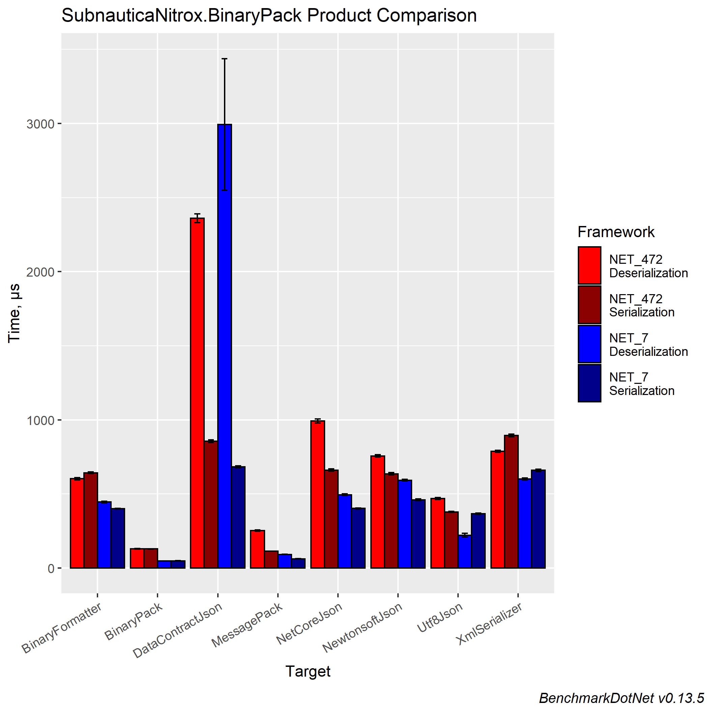
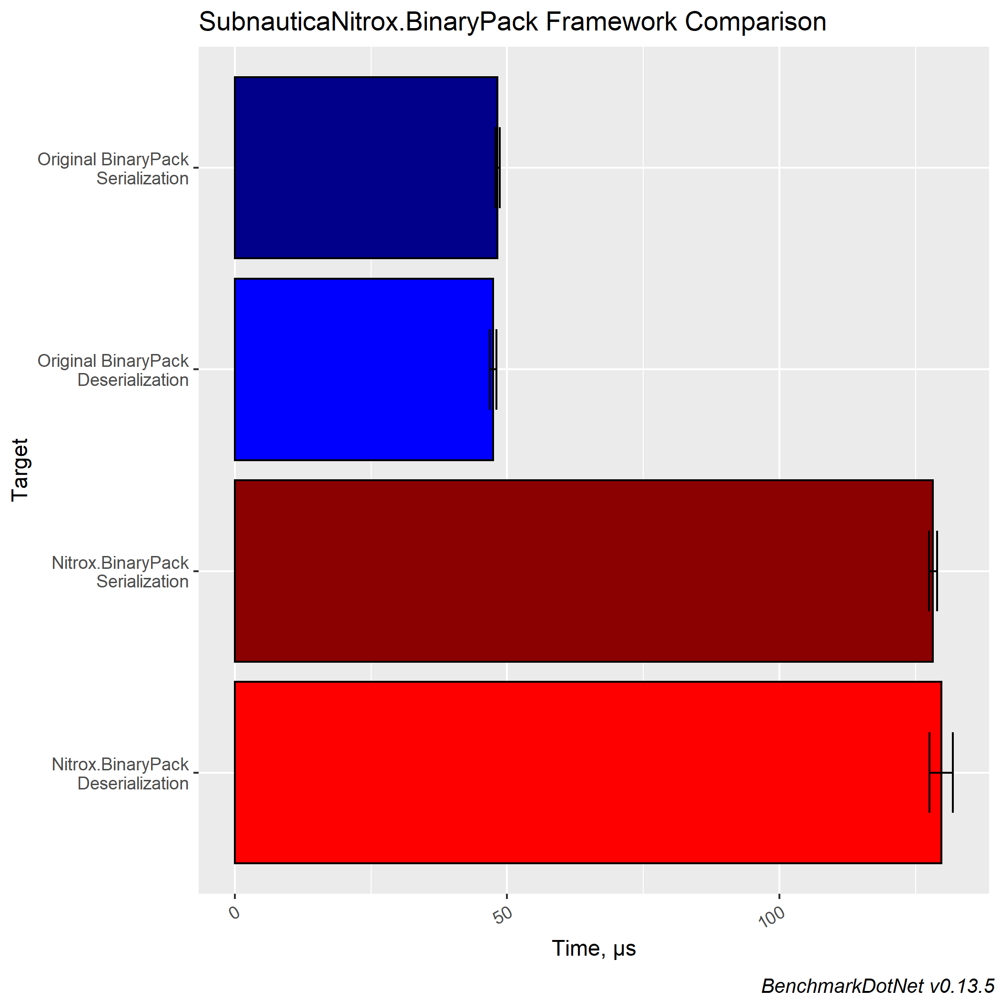

# Nitrox BinaryPack

A fork of the official [`BinaryPack`](https://github.com/Sergio0694/BinaryPack/). It has a few additional features and provides support for net472.

## Supported properties

Here is a list of the property types currently supported by the library:

✅ Primitive types (except `object`): `string`, `bool`, `int`, `uint`, `float`, `double`, etc.

✅ Nullable value types: `Nullable<T>` or `T?` for short, where `T : struct`

✅ Unmanaged types: eg. `System.Numerics.Vector2`, and all `unmanaged` value types

✅ Unions: eg. `abstract` classes

✅ .NET arrays: `T[]`, `T[,]`, `T[,,]`, etc.

✅ .NET collections: `List<T>`, `IList<T>`, `ICollection<T>`, `IEnumerable<T>`, etc.

✅ .NET dictionaries: `Dictionary<TKey, TValue>`, `IDictionary<TKey, TValue>` and `IReadOnlyDictionary<TKey, TValue>`

✅ Other .NET types: `BitArray`

## Benchmarks

Here are benchmarks executed with the benchmark sample ([JsonResponseModel](https://github.com/SubnauticaNitrox/BinaryPack/blob/master/unit/BinaryPack.Models/JsonResponseModel.cs)) included in this repository. You can click [here](BenchmarkResults/BinaryPack.Benchmark-report-github.md) for a detailed version.

# Requirements

This **BinaryPack** fork requires .NET Framework 4.7.2

The test projects also require .NET CoreApp 3.1
